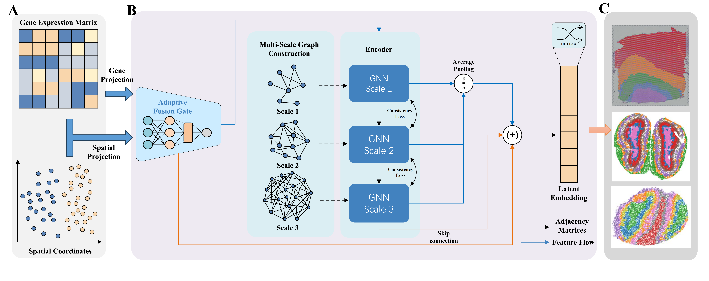

# MIST: A Multi-scale Interactive Gated Framework for Robust Spatial Domain Identification

## Overview

Spatial transcriptomics technologies have revolutionized our ability to characterize cellular organization, yet accurately delineating spatially coherent gene expression domains remains a computational challenge.

**MIST** is a novel deep learning framework designed to achieve robust spatial domain identification. It features:

- **Multi-scale Graph Neural Network:** Captures hierarchical tissue structures by constructing neighborhood graphs at small, medium, and large spatial scales.
- **Biologically-informed Graph Construction:** Edges are weighted by transcriptomic cosine similarity to filter out noise at domain boundaries.
- **Adaptive Fusion Gate:** Dynamically balances transcriptomic and spatial information at the per-spot level.

MIST consistently achieves state-of-the-art performance across diverse datasets, including human DLPFC (10x Visium), mouse olfactory bulb (Stereo-seq, Slide-seqV2), and developing mouse embryos.



##  Installation

We recommend using [Conda](https://docs.conda.io/en/latest/) to manage your environment. MIST is implemented in Python and relies on PyTorch and Scanpy.

```python
# 1. Clone the repository
git clone https://github.com/YourUsername/MIST.git
cd MIST

# 2. Create a conda environment
conda create -n mist_env python=3.8
conda activate mist_env

# 3. Install PyTorch (Please install the version matching your CUDA)
pip install torch==2.9.0 torchvision torchaudio --index-url https://download.pytorch.org/whl/cu118
pip install torch_geometric==2.7.0

```

# Requirements

Python == 3.9，
Torch == 2.9.0，
Scanpy == 1.11.5，
Anndata == 0.12.3，
NumPy == 2.2.6，
Rpy2 == 3.6.4，
Matplotlib == 3.10.7，
Tqdm == 4.67.1，
Scikit-learn == 1.7.2，
R == 4.5.1

## Tutorial

A Jupyter Notebook of the tutorial is accessible from :

https://github.com/JiruiZhang/MIST/MIST/DLPFC.ipynb

